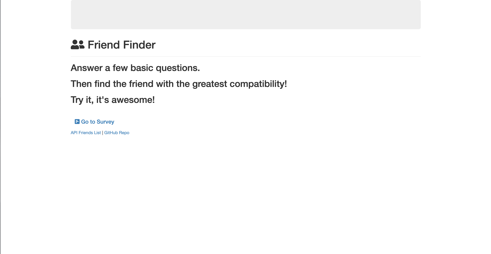
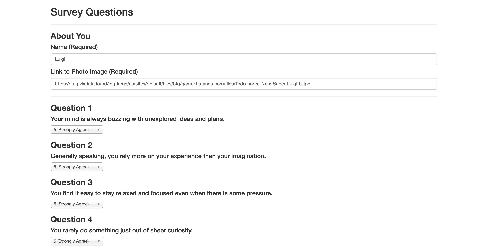
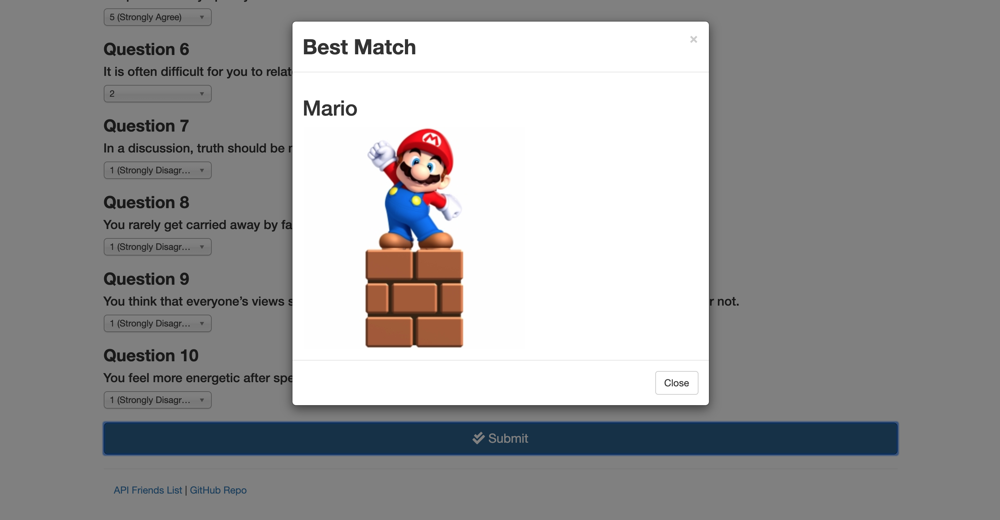
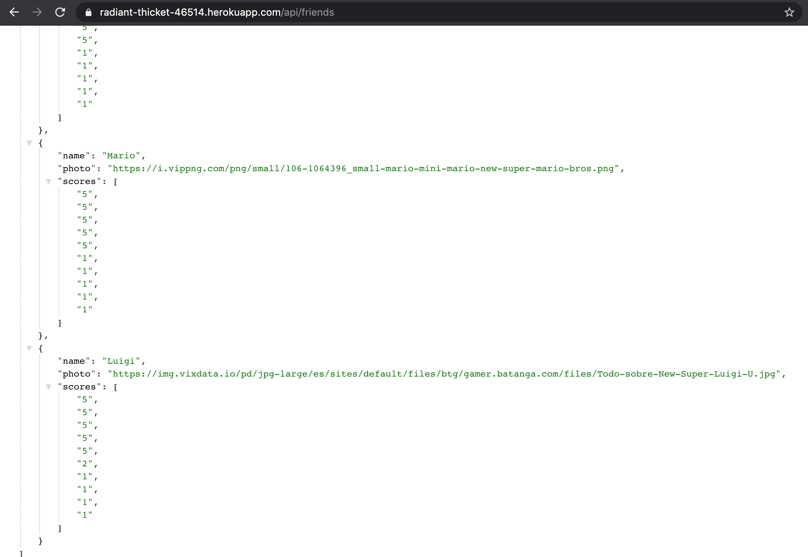

# Friend Finder

Friend Fiender is a compatibility-based application (basically a dating app), that take in results from users' surveys and compare their answers with those from other users. As a result, at the end of the survey, the app will display the name and picture of the user with the best overall match.

## How to install and run

In order to use the program, you will need to follow this steps: 

            1. git clone https://github.com/alfa9317/FriendFinder
            2. cd into the FriendFinder
            3. Run npm install to all dependencies
            4. Run node server.js
            5. Go to localhost:3000 in your web browser
            
            You will need to have previously installed Node.js

## --------------------👉🏻

## I just want to try it!

You can also just go to this url and start finding your best match:
      https://radiant-thicket-46514.herokuapp.com/

### Fill the survey

### Find your Match

### Take look to the info stored directly into the API

Required technologies:
Node.js,
Express,
Bootstrap,
Javascript,
Visual Studio Code.
